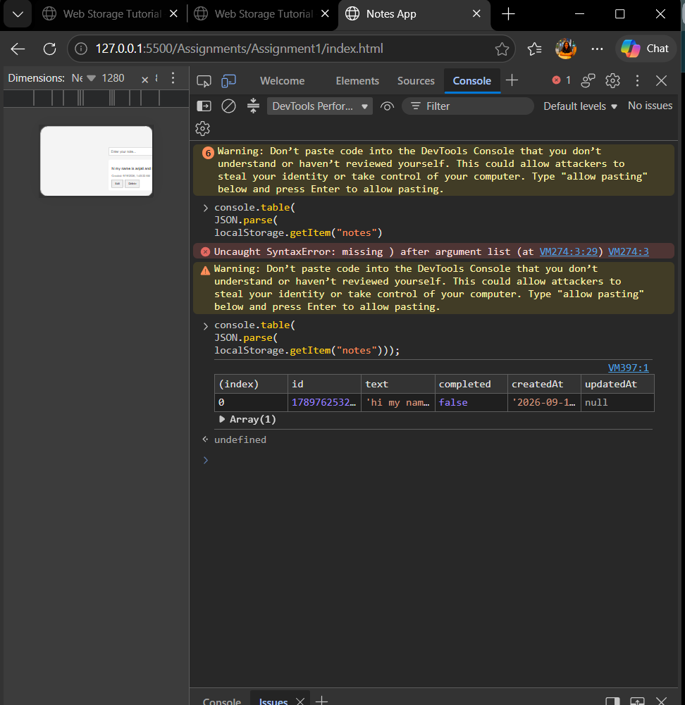

Screenshot of the opeartions performed

# Assignment 1 - Notes App

## Aim

To build a simple Notes / Todo application using only HTML, CSS, and JavaScript, and use `localStorage` to save notes permanently inside the browser.

## Objective

The objective of this assignment is to understand:

* How to create a simple frontend application
* How to perform CRUD operations using JavaScript
* How to store data using browser `localStorage`
* How to use JSON with `localStorage`
* How to dynamically display data on a webpage

## Technologies Used

* HTML
* CSS
* JavaScript
* Browser LocalStorage
* JSON

## Project Structure

```text
Assignment1/
│
├── index.html
├── style.css
├── script.js
└── README.md
```

## Features

The Notes App provides the following features:

* Add a new note
* Display all saved notes
* Edit an existing note
* Delete a note
* Store notes using LocalStorage
* Notes remain saved after refreshing the page
* Each note contains:

  * Unique ID
  * Note text
  * Created date and time
  * Updated date and time
  * Completion status

## Data Structure

Each note is stored as a JavaScript object.

Example:

```javascript
{
    id: Date.now(),
    text: "Study Java Backend",
    completed: false,
    createdAt: new Date().toISOString(),
    updatedAt: null
}
```

All notes are stored inside an array.

Example:

```javascript
[
    {
        id: 123456789,
        text: "Study Java Backend",
        completed: false,
        createdAt: "2026-09-19T10:30:00.000Z",
        updatedAt: null
    }
]
```

## LocalStorage

`localStorage` is used as the storage system for this application.

The notes are stored using the key:

```text
notes
```

Since `localStorage` stores values as strings, `JSON.stringify()` is used while saving data.

```javascript
localStorage.setItem("notes", JSON.stringify(notes));
```

While retrieving the data, `JSON.parse()` is used to convert the string back into a JavaScript array.

```javascript
JSON.parse(localStorage.getItem("notes"));
```

## CRUD Operations

CRUD stands for Create, Read, Update, and Delete.

### Create

A new note is created using the `addNote()` function.

```javascript
function addNote()
```

It takes the text entered by the user and creates a new note object.

### Read

Saved notes are retrieved using:

```javascript
function getNotes()
```

The notes are displayed on the webpage using:

```javascript
function renderNotes()
```

### Update

Existing notes can be edited using:

```javascript
function editNote(id)
```

When a note is edited, the `updatedAt` value is also changed.

### Delete

A note can be removed using:

```javascript
function deleteNote(id)
```

The `filter()` method is used to remove the selected note from the array.

## Main Functions Used

### getNotes()

Retrieves notes stored inside LocalStorage.

```javascript
function getNotes() {
    const raw = localStorage.getItem("notes");
    return raw ? JSON.parse(raw) : [];
}
```

### saveNotes()

Stores the notes array inside LocalStorage.

```javascript
function saveNotes(notes) {
    localStorage.setItem("notes", JSON.stringify(notes));
}
```

### addNote()

Creates a new note and saves it.

### renderNotes()

Displays all saved notes on the webpage.

### editNote()

Allows the user to modify an existing note.

### deleteNote()

Removes a selected note.

## Application Flow

```text
User enters a note
        ↓
JavaScript creates note object
        ↓
Note is added to notes array
        ↓
JSON.stringify()
        ↓
LocalStorage
        ↓
renderNotes()
        ↓
Note appears on webpage
```

## How to Run the Project

1. Open the `Assignment1` folder in Visual Studio Code.
2. Open `index.html`.
3. Right-click on `index.html`.
4. Select:

```text
Open with Live Server
```

5. The application will open in the browser.

Example URL:

```text
http://127.0.0.1:5500
```

## Testing

The following tests were performed:

### Add Note

Add a new note and check whether it appears on the webpage.

### Persistence Test

Add a note and refresh the page.

The note should still remain because it is stored in LocalStorage.

### Edit Test

Edit an existing note and refresh the page.

The updated note should remain saved.

### Delete Test

Delete a note and refresh the page.

The deleted note should not appear again.

### Empty Input Test

If the user tries to add an empty note, the application displays an alert and does not save the note.

## Checking LocalStorage

LocalStorage can be checked using browser Developer Tools.

Go to:

```text
F12
→ Application
→ Storage
→ Local Storage
→ localhost
```

The following key should be visible:

```text
notes
```

The stored notes can also be checked from the browser console using:

```javascript
console.table(JSON.parse(localStorage.getItem("notes")));
```

## Learning Outcome

After completing this assignment, I learned:

* How to create a simple Notes application using frontend technologies
* How CRUD operations work
* How JavaScript objects and arrays are used to manage data
* How to use `localStorage`
* How to convert JavaScript data into JSON using `JSON.stringify()`
* How to convert JSON data back using `JSON.parse()`
* How to dynamically update HTML using JavaScript
* How browser storage can be used without using a backend database

## Conclusion

In this assignment, a simple Notes App was developed using HTML, CSS, and JavaScript.

The application allows users to add, display, edit, and delete notes. LocalStorage is used to store the notes so that the data remains available even after the browser page is refreshed.

This assignment helped in understanding CRUD operations, DOM manipulation, JSON, and browser-based data storage.
